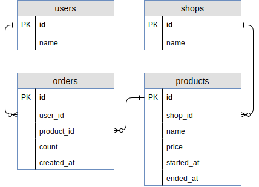

# Sample data of my presentation at Rails Developers Meetup 2018

This repository is used to create the sample data used in [my presentation](https://abicky.net/2018/03/25/141353/) [In Japanese].

## ER Diagram



## Prerequisites

Set the following environment variables:

Name | Default
-----|----------
MYSQL_DATABASE | railsdm2018
MYSQL_USER | root
MYSQL_PASSWORD |
MYSQL_HOST | localhost
MYSQL_PORT | 3306

## Setup tables

```
./bin/setup
```

## Insert sample data

```
rake db:insert
```

## Use sample models

```
% ./bin/console
[1] pry(main)> User.count
  User Count (0.8ms)  SELECT COUNT(*) FROM `users`
=> 100
```
